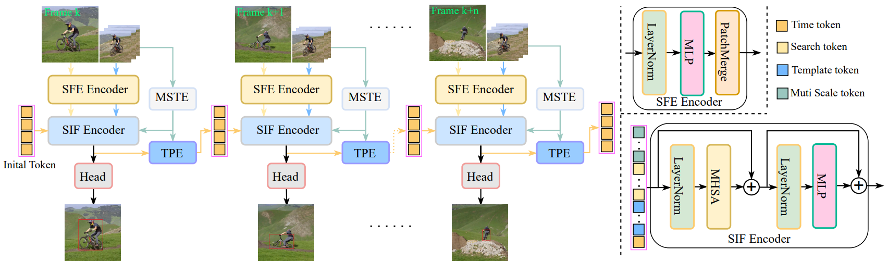

# M-STEP: Multi-Scale Temporal Information Enhancement and Propagation for Hierarchical Visual Transformer Tracking

The official implementation for the paper. \[[_M-STEP: Multi-Scale Temporal Information Enhancement and Propagation for Hierarchical Visual Transformer Tracking_](https://ieeexplore.ieee.org/abstract/document/11358797)\].

[[Models](https://drive.google.com/drive/folders/1ez0HGXUz52faHHGl1EshdKdTMwoCEbKB?usp=drive_link)], [[Raw Results](https://drive.google.com/drive/folders/1Nf1Ynq1uGx1QSoaRvjKj8CuBzjxaxA6O?usp=drive_link)]

<!-- [](https://paperswithcode.com/sota/visual-object-tracking-on-tnl2k?p=seqtrack-sequence-to-sequence-learning-for)
[](https://paperswithcode.com/sota/visual-object-tracking-on-lasot?p=seqtrack-sequence-to-sequence-learning-for)
[](https://paperswithcode.com/sota/visual-object-tracking-on-lasot-ext?p=seqtrack-sequence-to-sequence-learning-for)
[](https://paperswithcode.com/sota/visual-object-tracking-on-trackingnet?p=seqtrack-sequence-to-sequence-learning-for)
[](https://paperswithcode.com/sota/visual-object-tracking-on-got-10k?p=seqtrack-sequence-to-sequence-learning-for)
[](https://paperswithcode.com/sota/visual-object-tracking-on-uav123?p=seqtrack-sequence-to-sequence-learning-for)
[](https://paperswithcode.com/sota/visual-object-tracking-on-needforspeed?p=seqtrack-sequence-to-sequence-learning-for) -->


## Highlights

### :star2: New Video-Level Tracking Framework

<p align="center">
  
</p>

M-STEP is a simple, flexible and effective tracking pipeline, which densely associates the contextual relationships of video frames in an online token propagation manner. m_step receives video frames of arbitrary length to capture the spatio-temporal trajectory relationships of an instance, and compresses the discrimination features (localization information) of a target into a token sequence to achieve frame-to-frame association. 


### :star2: Strong Performance

| Tracker     | GOT-10K (AO) | LaSOT (AUC) | TrackingNet (AUC) | LaSOT_ext (AUC) | VOT2022-STB (EAO) | VastTrack (AUC) | OTB100 (AUC) | UAV123 (AUC)|
|:-----------:|:------------:|:-----------:|:-----------------:|:-----------:|:-----------:|:-----------:|:-----------:|:-----------:|
| M-STEP | 74.0         | 71.6        | 84.8              | 49.6          | 0.604          | 38.5          | 71.6          | 69.1 |


## Install the environment
```
conda create -n m_step python=3.8
conda activate m_step
bash install.sh
```


## Data Preparation
Put the tracking datasets in ./data. It should look like:
   ```
   ${PROJECT_ROOT}
    -- data
        -- lasot
            |-- airplane
            |-- basketball
            |-- bear
            ...
        -- got10k
            |-- test
            |-- train
            |-- val
        -- coco
            |-- annotations
            |-- images
        -- trackingnet
            |-- TRAIN_0
            |-- TRAIN_1
            ...
            |-- TRAIN_11
            |-- TEST
   ```


## Set project paths
Run the following command to set paths for this project
```
python tracking/create_default_local_file.py --workspace_dir . --data_dir ./data --save_dir ./output
```
After running this command, you can also modify paths by editing these two files
```
lib/train/admin/local.py  # paths about training
lib/test/evaluation/local.py  # paths about testing
```


## Training
Download pre-trained [MAE ViT-Base weights](https://dl.fbaipublicfiles.com/mae/pretrain/mae_pretrain_vit_base.pth) and put it under `$PROJECT_ROOT$/pretrained_networks` (different pretrained models can also be used, see [MAE](https://github.com/facebookresearch/mae) for more details).

```
python tracking/train.py \
--script m_step --config baseline \
--save_dir ./output \
--mode multiple --nproc_per_node 4 \
--use_wandb 1
```

Replace `--config` with the desired model config under `experiments/m_step`.

We use [wandb](https://github.com/wandb/client) to record detailed training logs, in case you don't want to use wandb, set `--use_wandb 0`.


## Test and Evaluation

- LaSOT or other off-line evaluated benchmarks (modify `--dataset` correspondingly)
```
python tracking/test.py m_step baseline --dataset lasot --runid 300 --threads 8 --num_gpus 2
python tracking/analysis_results.py # need to modify tracker configs and names
```
- GOT10K-test
```
python tracking/test.py m_step baseline_got --dataset got10k_test  --runid 100 --threads 8 --num_gpus 2
python lib/test/utils/transform_got10k.py --tracker_name m_step --cfg_name baseline_got_100
```
- TrackingNet
```
python tracking/test.py m_step baseline --dataset trackingnet  --runid 300 --threads 8 --num_gpus 2
python lib/test/utils/transform_trackingnet.py --tracker_name m_step --cfg_name baseline_300
```

- VOT2022
```
cd external/vot22/    <workspace_dir>
bash exp.sh
```


## Test FLOPs, and Speed
*Note:* The speeds reported in our paper were tested on a single RTX2080Ti GPU.

```
python tracking/profile_model.py --script m_step --config baseline
```


## Acknowledgments
* Thanks for the [STARK](https://github.com/researchmm/Stark) and [PyTracking](https://github.com/visionml/pytracking) library, which helps us to quickly implement our ideas.

